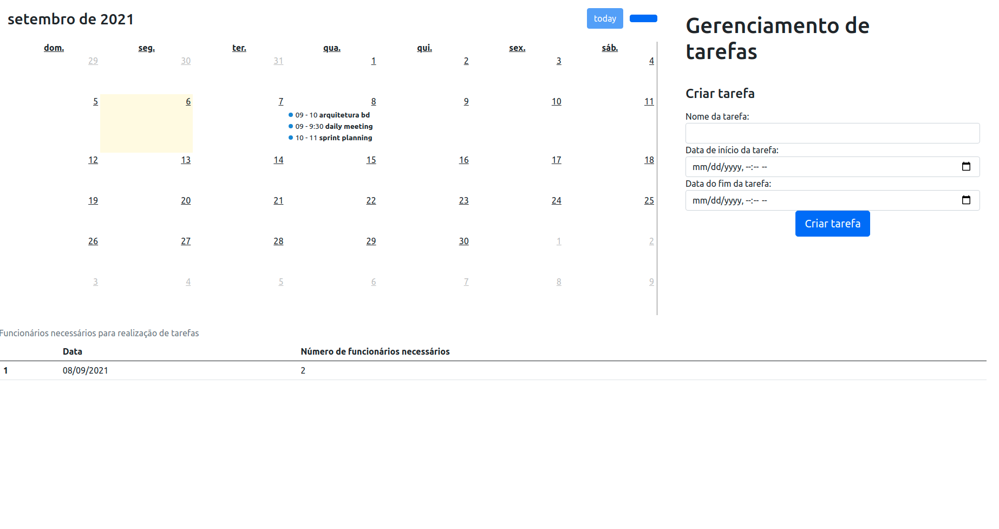

# Greed_Task_Manager

**Número da Lista**: 2<br>
**Conteúdo da Disciplina**: Greed (Interval partitioning)<br>

## Alunos
|Matrícula   |               Aluno                  |
| ---------- | ------------------------------------ |
| 15/0132590 |      João Vitor Ramos de Souza       |

## Sobre 

O Task_Manager tem como objetivo encontrar o número mínimo de funcionários necessários para a realização de tarefas alocadas para um dia. No projeto foi utilizada a biblioteca [FullCalendar](https://fullcalendar.io/) para renderizar o calendário que exibirá todas as tarefas inseridas pelo usuário, já o cálculo do número mínimo de funcionários é realizado por meio do algoritmo Interval Partitioning.
## Screenshots
1. Página inicial da aplicação com calendário e número mínimo de funcionários para executar as tarefas diariamente
   

## Instalação 
**Linguagem**: Python<br>
**Framework**: Django<br>

Pré-requisitos para rodar o **Task_Manager**:

É necessário ter o Python (versão 3.8.x), Pip e docker-compose instalados em seu sistema operacional.

Instale as dependências do Python no seu sistema operacional com o seguinte comando:
```sh
$ git clone https://github.com/projeto-de-algoritmos/Greed_Task_Manager.git
$ cd Greed_Task_Manager
$ pip3 install -r requirements.txt
```

Também é necessário ter um banco de dados Postgres sendo executado e para isso foi adicionado o docker-compose para se facilitar a criação do ambiente. Com o docker-compose instalado, basta executar o seguinte comando:

```sh
$ docker-compose up
```

**Importante:** O comando `docker-compose up` irá inutilizar o terminal aberto, para se subir o container do banco de dados em bacground, basta executar o comando `docker-compose up -d`

Realize as migrações do banco de dados com o seguinte comando:
```sh
$ python manage.py migrate
```

Suba o servidor Django com o comando abaixo:
```sh
$ python manage.py runserver
```
## Uso 

1. Com todos os comandos de instalação já executados, abra seu navegador em `http://localhost:8000/`
2. Após isso, basta adicionar as tarefas e seus horários de execução.
3. Com as tarefas adicionadas, a tabela na parte inferior da tela será populada com o dia e o número de funcionários necessários para a realização das tarefas

